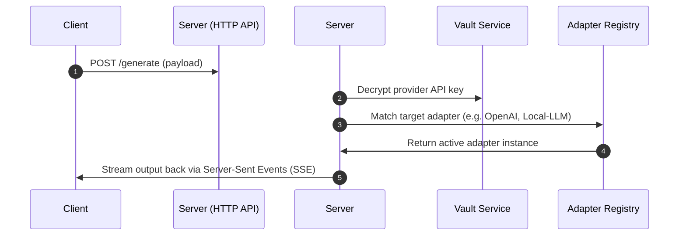
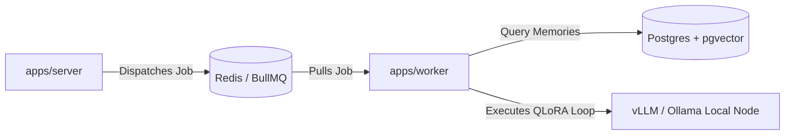

# 🌌 Shadow Node — Distributed Multi-Agent Neural Platform

> Neural Noir Operator Stack · Industry-Grade Monorepo · High-Performance Autonomous Workflows

---

## 👁️ Core Vision & Platform Concept
Shadow Node is a state-of-the-art multi-agent neural platform designed to orchestrate autonomous AI personas, run distributed node clusters, and process high-throughput semantic memory recalls. Featuring a cyber-noir design aesthetic, it distributes heavy generation workloads out-of-band to ensure zero-latency client connections.

---

## 🗂️ Monorepo Directory Structure

The workspace is organized as a Turborepo-powered monorepo with pnpm/npm workspaces:

```ini
shadow-node/                              # ── MONOREPO ROOT ───────────────────────
├── .github/
│   └── workflows/                        # CI/CD pipelines (Lint, Typecheck, Test, Deploy)
│
├── apps/
│   ├── client/                           # ── React 18 / Vite Client Portal ───────
│   │   ├── src/
│   │   │   ├── design-system/            # Glassmorphic cyber-noir visual components
│   │   │   ├── store/                    # Zustand client state (auth, UI, commands, nodes)
│   │   │   ├── pages/                    # 27+ view routing entries (Arena, Terminal, etc.)
│   │   │   └── lib/                      # Axios & telemetry helpers
│   │   └── package.json
│   │
│   ├── server/                           # ── NestJS Main HTTP API Gateway ────────
│   │   ├── src/
│   │   │   ├── modules/                  # Modular domain logic (Auth, Persona, Vault)
│   │   │   └── config/                   # JWT and LLM provider api configurations
│   │   └── package.json
│   │
│   └── worker/                           # ── NestJS Standalone Queue Worker ──────
│       ├── src/
│       │   ├── main.ts                   # Standalone bootstrap context (no port bound)
│       │   └── processors/               # BullMQ autonomous cron & workflow handlers
│       └── package.json
│
├── packages/
│   ├── database/                         # ── Central Shared Prisma pgvector ORM ──
│   │   ├── prisma/schema.prisma          # Canonical database schema
│   │   └── src/index.ts                  # Shared database client singleton + vector query
│   │
│   ├── ml/                               # ── AI/ML Preprocessing & Fine-Tuning ──
│   │   ├── src/fine-tune/                # QLoRA parameters & HuggingFace datasets converter
│   │   ├── src/embeddings/               # Recursive semantic text chunker script
│   │   └── notebooks/exploration.md      # Cosine thresholds & ELO experiments log
│   │
│   ├── research/                         # ── Evaluation Playground & Benchmarks ──
│   │   ├── src/evaluator.ts              # ELO ratings & quality scorecard calculator
│   │   └── src/experiment.ts             # Batch experiment test-bed runner
│   │
│   ├── types/                            # Shared type interfaces (Persona, Node, User)
│   └── tokens/                           # Design custom properties & CSS tokens
│
├── docker/                               # Optimized multi-stage Docker build containers
├── infra/                                # Pulumi / Terraform IaC scripts
├── package.json
├── pnpm-workspace.yaml
└── README.md
```

---

## ⚡ Tech Decision Matrix

| Concern | Choice | Industry Advantage |
|---|---|---|
| **Build System** | Turborepo + Workspaces | Superfast parallel builds, remote caching, single dependency tree |
| **API Server** | NestJS | Strictly typed Dependency Injection; clean domain decoupling |
| **Worker Queue** | BullMQ + Redis | Robust retry strategies, backoff configurations, self-hosted independence |
| **Database** | PostgreSQL + pgvector | Relational integrity paired with high-performance vector search in one engine |
| **Frontend** | React 18 + Vite | Instant Hot Module Replacement (HMR) and optimized chunk-splitting |
| **State Mgr** | Zustand | Minimal boilerplate, lightweight client caching |

---

## 📊 Architecture & Data Flow

### 1. Unified Generation Pipeline


### 2. Distributed Queue Task Processing


---

## ⚙️ Local Development Setup

### 🐳 The Fast Way (Docker Compose)
Spins up Postgres (with pgvector), Redis, Main Server, Background Worker, and Client Portal in one command:
```bash
docker-compose up --build
```
* Client: `http://localhost:5173`
* Server API: `http://localhost:3000`

---

## 🛠️ Step-by-Step Workspace Guide

### 1. Database Migrations
Prisma schema lives centrally in `packages/database`. To update database states across all apps:
```bash
# Move into database directory
cd packages/database

# Rebuild client types
npm run db:generate

# Deploy local schema update
npm run db:migrate
```

### 2. Running AI/ML Pipelines
Clean datasets, redact PII, chunk files, and generate fine-tuning parameters locally:
```bash
cd packages/ml

# 1. Anonymize chat logs
python src/pipelines/data_preprocessing.py --input raw.json --output clean.json

# 2. Build HuggingFace ChatML training set
python src/fine-tune/dataset_generator.py --input clean.json --output ft_ready.json

# 3. Preprocess context knowledge into vector chunks
python src/embeddings/vectorizer.py --input raw_docs.txt
```

### 3. Model Benchmark Experiments
To test prompt drift and compile ELO leaderboard shifts inside `@shadow/research`:
```bash
cd packages/research

# Runs prompt trials against multiple target models and prints latency vs ELO drifts
npm run experiment:run
```

---

## 🌐 Production Topology (AWS)

```ini
Production (AWS)
├── CloudFront CDN ───────────► S3 / Cloudflare Pages (React static files)
├── Application Load Balancer
│   ├── Port :80 / :443 ──────► ECS Fargate [apps/server] (HTTP API - Scales by Connection Count)
│   └── (Internal) ───────────► ECS Fargate [apps/worker] (Processors - Scales by Queue Depth)
├── Aurora PostgreSQL 16 ─────► pgvector memory tables
└── ElastiCache Redis 7 ──────► BullMQ queue persistence
```
