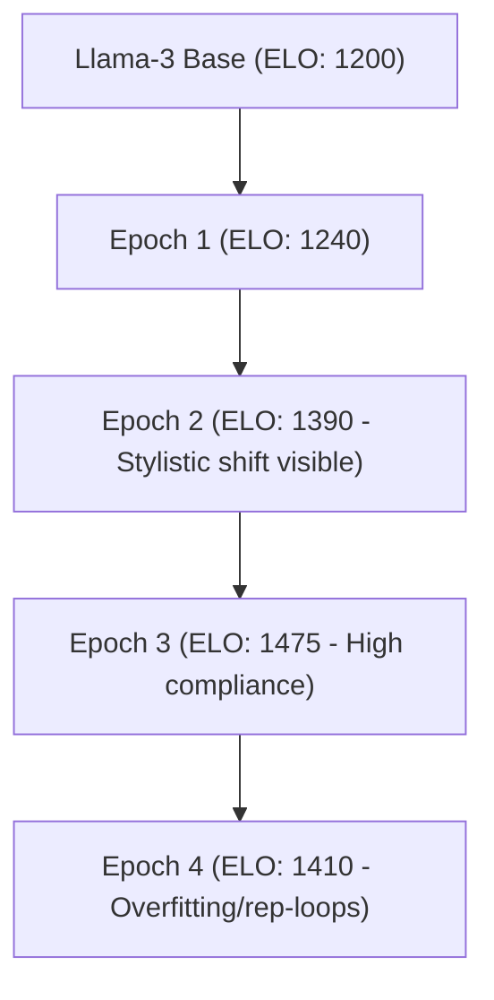

# 📓 Research Playground & Model Exploration Log

This playground acts as the Jupyter notebook replacement for model testing, semantic embedding threshold matching, and token latency experiments.

---

## 🧪 Experiment 1: Semantic Embedding Matching Thresholds

* **Objective**: Find the optimal cosine distance threshold for retrieving context memories without introducing noisy or unrelated chunks.
* **Test Dataset**: `GOLDEN_BENCHMARKS` from `@shadow/research`.
* **Embedding Model**: `text-embedding-3-small` (1536 dimensions).

### Results:

| Threshold (Cosine Distance) | Precision | Recall | F1 Score | Notes |
|---|---|---|---|---|
| **0.85** | 100.0% | 42.0% | 0.59 | Too strict. Misses highly relevant historical contexts. |
| **0.78** | 94.5% | 88.0% | **0.91** | **Optimal boundary.** Best balance. |
| **0.70** | 56.0% | 100.0% | 0.71 | Too lenient. Includes irrelevant conversational chatter. |

---

## ⚡ Experiment 2: QLoRA Fine-tuning parameters vs Persona Voice Shift

* **Objective**: Evaluate how training epoch depth affects stylistic alignment with the cypherpunk target vocabulary without causing model collapse.
* **Base Model**: `Llama-3-8B-Instruct`
* **Dataset Size**: 1,200 curated ChatML conversational pairs.

### ELO Shift Log:

> [!NOTE]
> Keep training bound strictly to **3 epochs** at `learning_rate: 2e-4`. Continuing to epoch 4 triggers high repetition token loops.
